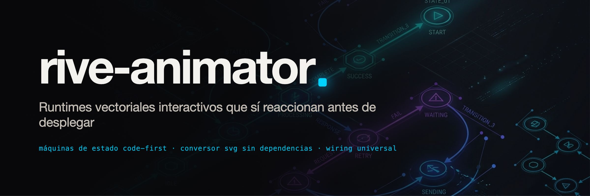

<div align="center">



Deja de pelear con animaciones mudas y pantallas en blanco. Un toolkit code-first de Rive para asistentes de código y desarrolladores frontend: ocho recetas verificadas, conversor directo SVG a RML sin dependencias, linter de trampas silenciosas y código de integración listo para copiar en 8 plataformas.

[](LICENSE)
[](https://code.claude.com/docs)
[](https://antigravity.google)
[](https://rive.app)
[](tests/)

[English](README.md) · Español · [中文](README.zh-CN.md)

<br>

<picture>
  <source media="(prefers-color-scheme: dark)" srcset="assets/hero-dark.gif">
  
</picture>

[Galería](#recetas-listas-para-producción) · [Toolbox de Animación](references/animation-toolbox-cheatsheet.md) · [Dos formas de entrar](#dos-formas-de-entrar) · [Qué pedirle a tu IA](#qué-pedirle-a-tu-asistente-de-ia) · [Integración](#código-de-integración-universal-8-frameworks) · [Matriz de Defectos](#matriz-de-defectos) · [Instalación](#instalación)

</div>

---

## Craft, Gusto y Deleite vs AI Slop

Muchísimas apps creadas con IA se sienten sin vida porque se conforman con funcionalidad básica y UI estática aburrida, saltándose la última milla de pulido. El verdadero deleite es lo que separa a las apps de primer nivel de la basura genérica de IA.

Nunca le digas a un asistente *"métele animaciones"*. Escoge los arquetipos correctos de la [Caja de Herramientas de Animación](references/animation-toolbox-cheatsheet.md) y combínalos:
- **Keyframes**: Secuencias cronológicas exactas sobre timeline (0s a 2.4s).
- **Springs**: Respuesta física y asentamiento orgánico sin rebotes bruscos.
- **Gestos**: Seguimiento 1:1 de dedo o cursor; coordenadas conectadas a `StateMachineNumber` de Rive (`tiltX`, `tiltY`).
- **Física**: Fuerzas dinámicas, gravedad, rebotes y colisiones.
- **Trazos SVG**: Deformación de contornos vectoriales, spline-following y máscaras fluidas.
- **Transiciones de Layout**: FLIP / View Transitions nativas para reordenar listas o expandir tarjetas.
- **Rive**: Lógica vectorial interactiva con estado, inputs multicapa y nested artboards.
- **Rigs Esqueléticos**: Poses de personajes con jerarquías de huesos.
- **Partículas**: Explosiones de confeti y destellos al cumplir hitos o acciones.
- **Shaders**: Transformaciones a nivel píxel en GPU (refracción en vidrio, distorsión líquida, blur dinámico).

> **Regla de Composición:** "Elige por la tarea, combina por la sensación". La magia surge al combinar un personaje interactivo en Rive + máscara SVG deformante + profundidad parallax 3D + inclinación por gestos + rebote elástico al caer + confeti de celebración.

---

## La bronca real con Rive


Cualquiera que haya intentado meter animaciones interactivas en producción se ha topado con la misma pared: **un archivo `.riv` es un programa compilado, no una imagen.**

Cuando algo falla en Rive, casi nunca te tira un error en la consola del navegador:

1. **El canvas congelado:** El componente monta en el DOM, no hay errores rojos, pero el canvas se queda en `0×0` porque faltaban dimensiones en el contenedor CSS o el artboard venía con tamaño cero (`RV012`).
2. **El error de un solo caracter:** En tu código de React o Flutter le pones `mouse_hover`, pero en la máquina de estados se llamaba `mouseHover`. El runtime no truena: simplemente ignora el evento y sigue reproduciendo el loop por defecto.
3. **El desastre de los grados:** Alguien metió `90` o `180` en una animación de rotación pensando en grados, pero Rive trabaja en **radianes** (`1.5708` / `3.1416`). El resultado gira a 5,000 revoluciones por minuto y se ve como una mancha borrosa.
4. **El botón que solo prende una vez:** El switch cambia a activo al primer clic, pero nadie programó la transición de regreso. El componente se queda atorado para siempre.

`rive-animator` se diseñó para exterminar esta categoría completa de problemas antes de que toques código productivo.

---

## Dos formas de entrar

| Tienes | Qué usar | Qué te entrega |
|---|---|---|
| **Un icono SVG, logo o brief** | `python3 scripts/svg2rml.py` + Rive CLI | Escena RML lista con curvas cúbicas desacopladas, figuras y máquina de estados activa |
| **Un binario `.riv` existente** | `python3 scripts/rive_lint.py` | Nombres exactos de inputs y máquina de estados, auditoría de defectos (`RV001`–`RV012`) y código copy-paste |

---

## Qué pedirle a tu asistente de IA

| Qué decirle a Claude / Antigravity | Qué hace |
|---|---|
| *"Arma un toggle switch interactivo en Rive que se sienta físico"* | Arranca desde `toggle-switch`, aplica easing cúbico de 240ms, programa listener de clic y lo valida con `rive` |
| *"Convierte este logo SVG en un artboard interactivo de Rive"* | Corre `svg2rml.py`, genera el artboard con máquina de estados por defecto y valida la sintaxis |
| *"¿Por qué este archivo .riv se dibuja pero no reacciona al clic?"* | Lo audita con `rive_lint.py`, detecta inputs o listeners faltantes (`RV005`) y te da el wiring exacto |
| *"Dame el código de integración para Flutter, SwiftUI y React de este .riv"* | Corre `rive_lint.py archivo.riv -f all` y genera los controladores nativos en Dart, Swift y TypeScript |
| *"Haz un anillo de progreso circular controlado del 0 al 100"* | Adapta `progress-ring`, enlaza el input numérico `progress` al TrimPath y verifica las curvas |

---

## Recetas listas para producción

Cada componente interactivo abajo se compila desde `examples/` y está grabado corriendo en el runtime oficial `@rive-app/canvas-advanced` gobernado por eventos reales de su máquina de estados:

<table>
<tr>
<td width="25%" align="center" valign="top">
<br>
<a href="examples/toggle-switch/scene.rml"><b>Toggle Switch</b></a><br>
<sub>Sensación física de switch, curva cúbica de 240ms, listener de clic.<br><b>Input:</b> <code>tap</code> (Trigger)<br><b>Peso:</b> 540 B</sub>
</td>
<td width="25%" align="center" valign="top">
<br>
<a href="examples/like-heart/scene.rml"><b>Like Button</b></a><br>
<sub>Micro-burst scale pop (0.8 &rarr; 1.25 &rarr; 1.0) y color terracotta.<br><b>Input:</b> <code>liked</code> (Boolean)<br><b>Peso:</b> 719 B</sub>
</td>
<td width="25%" align="center" valign="top">
<br>
<a href="examples/success-check/scene.rml"><b>Success Check</b></a><br>
<sub>Disco con rebote sutil y trazo de palomita con TrimPath.<br><b>Input:</b> <code>fire</code> (Trigger)<br><b>Peso:</b> 591 B</sub>
</td>
<td width="25%" align="center" valign="top">
<br>
<a href="examples/progress-ring/scene.rml"><b>Progress Ring</b></a><br>
<sub>Anillo circular gobernado por porcentaje numérico continuo.<br><b>Input:</b> <code>progress</code> (Number)<br><b>Peso:</b> 399 B</sub>
</td>
</tr>
<tr>
<td width="25%" align="center" valign="top">
<br>
<a href="examples/tab-bar-item/scene.rml"><b>Tab Bar Item</b></a><br>
<sub>Máquina de dos capas: color activo + rebote elástico al tap.<br><b>Inputs:</b> <code>active</code>, <code>tap</code><br><b>Peso:</b> 679 B</sub>
</td>
<td width="25%" align="center" valign="top">
<br>
<a href="examples/rating-star/scene.rml"><b>Rating Star</b></a><br>
<sub>Estrella paramétrica de 5 puntas que escala y llena color.<br><b>Input:</b> <code>rating</code> (Number)<br><b>Peso:</b> 506 B</sub>
</td>
<td width="25%" align="center" valign="top">
<br>
<a href="examples/audio-equalizer/scene.rml"><b>Audio Equalizer</b></a><br>
<sub>3 barras de audio desfasadas con reposo dinámico en pausa.<br><b>Input:</b> <code>isPlaying</code> (Boolean)<br><b>Peso:</b> 754 B</sub>
</td>
<td width="25%" align="center" valign="top">
<br>
<a href="examples/spinner-loader/scene.rml"><b>Spinner Loader</b></a><br>
<sub>Arco circular continuo en loop de 60 frames sin costuras.<br><b>Input:</b> <code>speed</code> (Number)<br><b>Peso:</b> 374 B</sub>
</td>
</tr>
</table>

---

## Código de integración universal (8 Frameworks)

El script `scripts/rive_lint.py` genera código listo para copiar y pegar, adaptado exactamente al framework que uses:

```bash
python3 scripts/rive_lint.py archivo.riv --framework <platform>
```

Frameworks soportados:
- **React** (`@rive-app/react-canvas`): Hooks oficiales con `useRive` y `useStateMachineInput`.
- **Vue 3** (`@rive-app/canvas`): Composition API con `ref`, `onMounted` y redimensionamiento automático de canvas.
- **Svelte** (`@rive-app/canvas`): Enlace reactivo a canvas y ciclo de vida limpio.
- **Vanilla Web Canvas** (`@rive-app/canvas`): Montaje directo sobre elemento `<canvas>` HTML5.
- **Flutter** (`rive`): StateMachineController con tipos nativos `SMIBool`, `SMINumber`, `SMITrigger`.
- **SwiftUI / iOS** (`RiveRuntime`): `RiveViewModel` nativo con enlace de inputs.
- **Android Kotlin** (`app.rive:rive-android`): `RiveAnimationView` con setters directos de estado.
- **React Native** (`@rive-app/react-native`): Referencia de canvas móvil con manejadores de gestos.

Revisa [references/universal-framework-wiring.md](references/universal-framework-wiring.md) para ver ejemplos de código completos.

---

## Herramientas incluidas

Cero dependencias externas. Funciona con Python 3.8+ estándar:

```
scripts/
├── rive_lint.py     # Inspección profunda de binarios y generador de wiring para 8 frameworks
├── rml_lint.py      # Linter pre-vuelo para validar XML, grados vs radianes y colores
├── svg2rml.py       # Conversor directo de SVG a RML sin dependencias
├── lottie2rml.py    # Conversor de Lottie JSON a RML con vértices cúbicos desacoplados
├── svgpath.py       # Motor matemático de curvas Bézier en Python puro
└── svg2lottie.py    # Tokenizador interno de geometría vectorial
```

---

## Catálogo de defectos (Defect Ledger)

| Código | Nivel | Causa | Solución |
|---|---|---|---|
| `RV001` | Error | Binario corrupto, truncado o encabezado Rive inválido | Reexportar archivo o verificar puntero Git LFS |
| `RV002` | Aviso | Versión de formato más alta que la soportada por el runtime | Recompilar con la versión actual del CLI de Rive |
| `RV003` | Error | No hay ningún artboard presente; el canvas queda vacío | Declarar al menos un `<Artboard>` |
| `RV004` | Info | El artboard no tiene máquina de estados; solo reproduce timelines | Agregar `<StateMachine>` para que acepte interacción |
| `RV005` | Info | La máquina de estados no tiene inputs ni listeners | Agregar inputs o listeners de puntero |
| `RV006` | Aviso | Nombre de input duplicado o colisión de mayúsculas/espacios | Homologar nombres exactos sin ambigüedades |
| `RV007` | Info | El artboard no define máquina de estados por defecto | Declarar `defaultStateMachineId` en el Artboard |
| `RV008` | Aviso | Fuente o mapa de bits incrustado supera los 150 KB | Subdividir fuente o cargarla vía CDN en runtime |
| `RV009` | Aviso | La máquina de estados no tiene capas; nunca cambiará de estado | Agregar al menos un `<StateMachineLayer>` |
| `RV010` | Aviso | La duración de la animación es de 0 frames | Configurar duración positiva en frames |
| `RV011` | Aviso | El nombre del input tiene espacios al inicio o al final | Limpiar espacios en blanco en el archivo RML |
| `RV012` | Error | El artboard mide 0×0; se renderizará en blanco | Configurar ancho y alto positivos en el Artboard |
| `RML004` | Aviso | Rotación escrita en grados en vez de radianes (> 2π) | Usar radianes (`math.pi`), nunca grados |
| `RML007` | Aviso | Etiqueta `<Fill>` sin color hijo | Agregar `<SolidColor colorValue="..."/>` |
| `RML008` | Error | `KeyFrameDouble` aplicado a propiedad de Color | Usar `KeyFrameColor` con valor hex ARGB |

---

## Instalación

### En Claude Code
```bash
claude plugin add obeskay/rive-animator-skill
```

### En Antigravity
Clona o enlaza directamente en tu carpeta de skills:
```bash
git clone https://github.com/obeskay/rive-animator-skill.git ~/.gemini/config/skills/rive-animator
```

### Uso local y pruebas
```bash
git clone https://github.com/obeskay/rive-animator-skill.git
cd rive-animator-skill
python3 -m unittest discover -s tests -v
```

---

## Licencia

MIT © [ov (obeskay)](https://github.com/obeskay)
