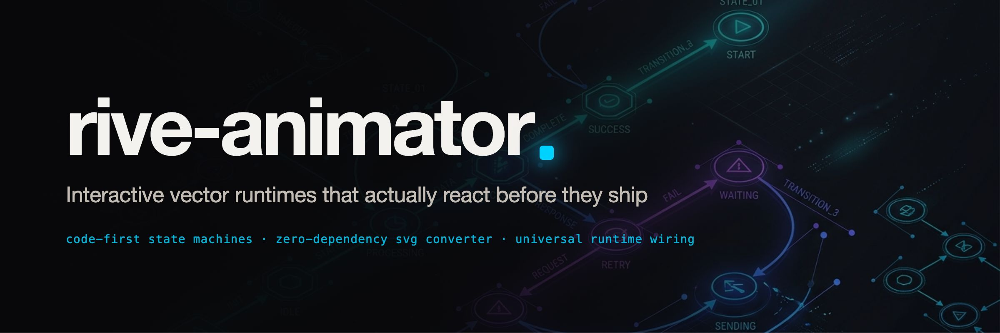

<div align="center">



Stop fighting silent runtime bugs and blank canvases. A code-first Rive toolkit for AI coding agents and frontend developers: eight verified recipes, zero-dependency SVG-to-RML converter, pre-flight linter for silent traps, and copy-paste runtime wiring across 8 platforms.

[](LICENSE)
[](https://code.claude.com/docs)
[](https://antigravity.google)
[](https://rive.app)
[](tests/)

English · [Español](README.es.md) · [中文](README.zh-CN.md)

<br>

<picture>
  <source media="(prefers-color-scheme: dark)" srcset="assets/hero-dark.gif">
  
</picture>

[Gallery](#shipped-recipes) · [Animation Toolbox](references/animation-toolbox-cheatsheet.md) · [Two Ways In](#two-ways-in) · [What to Ask](#what-to-ask-your-ai-assistant) · [Framework Wiring](#universal-framework-wiring) · [Defect Ledger](#defect-ledger) · [Install](#installation)

</div>

---

## Craft, Taste & Delight vs AI Slop

A lot of vibe-coded apps feel lifeless because they settle for raw functionality and bare-bones static UI, skipping the "last mile" of polish. True delight is what separates top-tier software from AI slop.

Never just ask an AI to *"add animations"*. Pick from the [11 Animation Archetypes](references/animation-toolbox-cheatsheet.md) and layer them together:
- **Keyframes**: Choreograph fixed timeline sequences (0s–2.4s).
- **Springs**: Give UI controls responsive physical settle with zero overshoot.
- **Gestures**: Follow finger and cursor touch 1:1; stream coordinates into Rive `StateMachineNumber` (`tiltX`, `tiltY`).
- **Physics**: Let dynamic forces, momentum, and bounds collisions take control.
- **SVG Paths**: Draw, morph vector geometry, and follow curved paths.
- **Layout Transitions**: Native FLIP / View Transitions when reordering grids and expanding cards.
- **Rive**: Stateful interactive vector logic, multi-layer inputs, and nested artboards.
- **Skeletal Rigs**: Pose connected characters with bone hierarchies.
- **Particles**: Celebrate achievement milestones with confetti and starbursts.
- **Shaders**: Direct GPU pixel transformations (glass refraction, liquid warps, dynamic blur).

> **The Composition Rule:** "Pick by the job. Combine for the feeling." Real magic happens when you compose a Rive character state machine + SVG morphing background mask + 3D parallax depth + host continuous tilt + spring landing bounce + particle celebration.

---

## The Real Problem

Every developer who has tried shipping interactive vector graphics knows the frustration: **a `.riv` is a compiled program, not an image.** 


When motion or interactive state goes wrong in Rive, it almost never throws an error in your browser console:
1. **The Silent Freeze:** The file compiles cleanly and mounts, but the canvas stays at `0×0` because CSS sizing was missing, or an artboard had zero dimensions (`RV012`).
2. **The Name Mismatch Trap:** You wire `mouse_hover` in your React or Flutter component, but the state machine was authored as `mouseHover`. The runtime silently ignores your input and falls back to playing the default loop.
3. **The Degree Disaster:** A rotation keyframe was passed `90` or `180` instead of radians (`1.5708` / `3.1416`). The asset spins at 5,000 RPM into an unrecognizable blur.
4. **The One-Way Latch:** A toggle transitions to `active`, but the return transition was never authored. The component reacts on the first click and latches forever.

`rive-animator` eliminates this entire class of bugs before you touch production code.

---

## Two Ways In

| You have | Use | What it gives you |
|---|---|---|
| **An SVG icon, logo, or brief** | `python3 scripts/svg2rml.py` + Rive CLI | Instant RML scene with detached cubic vertices, shapes, and active state machine |
| **An existing `.riv` binary** | `python3 scripts/rive_lint.py` | Exact runtime state machine names, defect checks (`RV001`–`RV012`), and copy-paste code |

---

## What to ask your AI Assistant

| Say to Claude / Antigravity | What it does |
|---|---|
| *"Build an interactive toggle switch in Rive that feels like physical hardware"* | Starts from `toggle-switch`, sets 240ms cubic ease, authors click listener, verifies with `rive` |
| *"Convert this SVG logo to an interactive Rive artboard"* | Runs `svg2rml.py`, creates artboard and default state machine, validates syntax |
| *"Why does my Rive animation draw but ignore my clicks?"* | Lints with `rive_lint.py`, diagnoses missing inputs or listeners (`RV005`), prints exact wiring |
| *"Give me Flutter / SwiftUI / React wiring for mascot.riv"* | Runs `rive_lint.py mascot.riv -f <platform>` and generates native Dart, Swift, or TypeScript |
| *"Create a circular progress bar driven from 0 to 100"* | Adapts `progress-ring`, binds `progress` Number input to TrimPath, verifies easing |

---

## Shipped Recipes

Every animation below is compiled from `examples/` and recorded running inside the real `@rive-app/canvas-advanced` runtime driven by live scripted state machine inputs:

<table>
<tr>
<td width="25%" align="center" valign="top">
<br>
<a href="examples/toggle-switch/scene.rml"><b>Toggle Switch</b></a><br>
<sub>Hardware feel, 240ms cubic ease, click listener.<br><b>Input:</b> <code>tap</code> (Trigger)<br><b>Size:</b> 540 B</sub>
</td>
<td width="25%" align="center" valign="top">
<br>
<a href="examples/like-heart/scene.rml"><b>Like Button</b></a><br>
<sub>Micro-burst scale pop (0.8 &rarr; 1.25 &rarr; 1.0) and fill.<br><b>Input:</b> <code>liked</code> (Boolean)<br><b>Size:</b> 719 B</sub>
</td>
<td width="25%" align="center" valign="top">
<br>
<a href="examples/success-check/scene.rml"><b>Success Check</b></a><br>
<sub>Settling disc with trim-draw checkmark on completion.<br><b>Input:</b> <code>fire</code> (Trigger)<br><b>Size:</b> 591 B</sub>
</td>
<td width="25%" align="center" valign="top">
<br>
<a href="examples/progress-ring/scene.rml"><b>Progress Ring</b></a><br>
<sub>Circular progress ring driven by numerical percentage.<br><b>Input:</b> <code>progress</code> (Number)<br><b>Size:</b> 399 B</sub>
</td>
</tr>
<tr>
<td width="25%" align="center" valign="top">
<br>
<a href="examples/tab-bar-item/scene.rml"><b>Tab Bar Item</b></a><br>
<sub>Dual-layer state machine: active color + spring tap bounce.<br><b>Inputs:</b> <code>active</code>, <code>tap</code><br><b>Size:</b> 679 B</sub>
</td>
<td width="25%" align="center" valign="top">
<br>
<a href="examples/rating-star/scene.rml"><b>Rating Star</b></a><br>
<sub>Parametric 5-point star that scales and fills with color.<br><b>Input:</b> <code>rating</code> (Number)<br><b>Size:</b> 506 B</sub>
</td>
<td width="25%" align="center" valign="top">
<br>
<a href="examples/audio-equalizer/scene.rml"><b>Audio Equalizer</b></a><br>
<sub>3 phase-offset audio bars with idle settle states.<br><b>Input:</b> <code>isPlaying</code> (Boolean)<br><b>Size:</b> 754 B</sub>
</td>
<td width="25%" align="center" valign="top">
<br>
<a href="examples/spinner-loader/scene.rml"><b>Spinner Loader</b></a><br>
<sub>Circular stroke chase, continuous 60-frame loop.<br><b>Input:</b> <code>speed</code> (Number)<br><b>Size:</b> 374 B</sub>
</td>
</tr>
</table>

---

## Universal Framework Wiring

`scripts/rive_lint.py` automatically generates exact, copy-paste wiring tailored to your target platform:

```bash
python3 scripts/rive_lint.py mascot.riv --framework <platform>
```

Supported platforms:
- **React** (`@rive-app/react-canvas`): Hooks with `useRive` and `useStateMachineInput`.
- **Vue 3** (`@rive-app/canvas`): Composition API with `ref`, `onMounted`, and canvas resize.
- **Svelte** (`@rive-app/canvas`): Reactive canvas binding and lifecycle cleanup.
- **Vanilla Web Canvas** (`@rive-app/canvas`): Direct HTML5 canvas mounting.
- **Flutter** (`rive`): StateMachineController with typed `SMIBool`, `SMINumber`, `SMITrigger`.
- **SwiftUI / iOS** (`RiveRuntime`): Native `RiveViewModel` with state machine bindings.
- **Android Kotlin** (`app.rive:rive-android`): `RiveAnimationView` with typed state setters.
- **React Native** (`@rive-app/react-native`): Mobile canvas ref with touch gesture handlers.

See [references/universal-framework-wiring.md](references/universal-framework-wiring.md) for full examples.

---

## Toolchain Overview

Zero external dependencies. Pure Python 3.8+ standard library.

```
scripts/
├── rive_lint.py     # Binary inspector, defect audit, 8-framework wiring generator
├── rml_lint.py      # Pre-flight XML validator for degrees vs radians, colors, gotchas
├── svg2rml.py       # Direct zero-dependency SVG to RML artboard converter
├── lottie2rml.py    # Lottie JSON to RML converter with detached cubic vertices
├── svgpath.py       # Pure-Python SVG cubic bezier decomposition engine
└── svg2lottie.py    # Internal vector geometry tokenizer
```

---

## Defect Ledger

| Code | Level | Description | Fix |
|---|---|---|---|
| `RV001` | Error | Binary is corrupted, truncated, or invalid header | Re-export file; check git LFS pointer |
| `RV002` | Warning | Format version higher than runtime support | Rebuild with current Rive CLI version |
| `RV003` | Error | No artboard present; canvas stays empty | Author at least one `<Artboard>` |
| `RV004` | Info | Artboard has no state machine; static timeline only | Add `<StateMachine>` so inputs can drive it |
| `RV005` | Info | State machine has no inputs and no listeners | Add inputs or pointer listeners |
| `RV006` | Warning | Duplicate input name or casing collision | Match exact spelling and capitalization |
| `RV007` | Info | Artboard has no default state machine specified | Set `defaultStateMachineId` on Artboard |
| `RV008` | Warning | Embedded font or bitmap exceeds 150 KB | Subset font or load via CDN at runtime |
| `RV009` | Warning | State machine has no layers; can never transition | Add at least one `<StateMachineLayer>` |
| `RV010` | Warning | Timeline animation duration is 0 frames | Author positive frame duration |
| `RV011` | Warning | Input name has leading or trailing whitespace | Trim input names in RML |
| `RV012` | Error | Artboard has dimensions 0×0; renders blank | Set positive width and height on Artboard |
| `RML004` | Warning | Rotation authored in degrees (> 2π) | Use radians (`math.pi`), not degrees |
| `RML007` | Warning | `<Fill>` tag missing paint child | Add `<SolidColor colorValue="..."/>` child |
| `RML008` | Error | `KeyFrameDouble` placed on Color property | Use `KeyFrameColor` for color properties |

---

## Installation

### For Claude Code
```bash
claude plugin add obeskay/rive-animator-skill
```

### For Antigravity
Clone or link into your agent skills directory:
```bash
git clone https://github.com/obeskay/rive-animator-skill.git ~/.gemini/config/skills/rive-animator
```

### Local Testing
```bash
git clone https://github.com/obeskay/rive-animator-skill.git
cd rive-animator-skill
python3 -m unittest discover -s tests -v
```

---

## License

MIT © [ov (obeskay)](https://github.com/obeskay)
