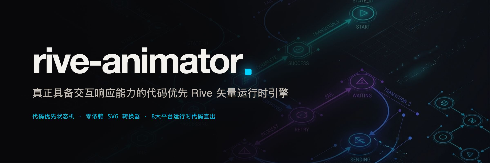
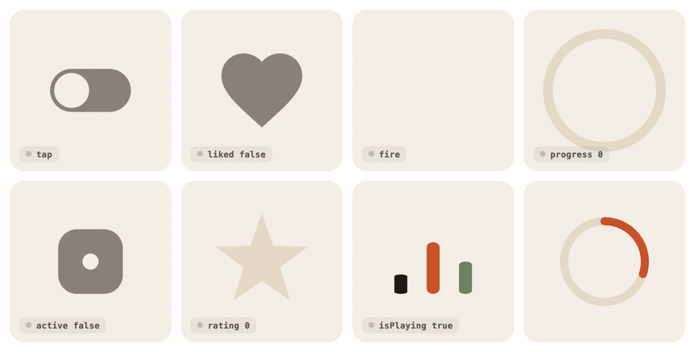
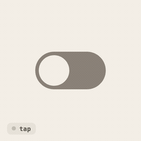
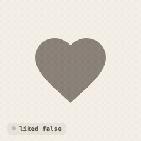
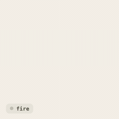
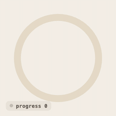
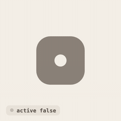
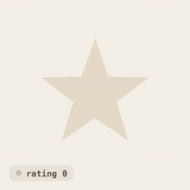
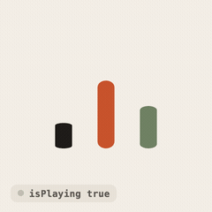
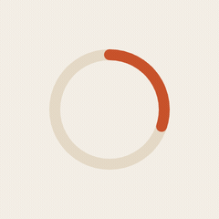

<div align="center">



告别静默假死与空白画布。专为 AI 编程助手与现代前端开发者打造的代码优先 Rive 工具包：包含 8 个验证完毕的交互组件模板、零第三方依赖 SVG 直转 RML 转换器、静默错误预检工具，以及覆盖 8 大跨端平台的免手写接入代码生成器。

[](LICENSE)
[](https://code.claude.com/docs)
[](https://antigravity.google)
[](https://rive.app)
[](tests/)

[English](README.md) · [Español](README.es.md) · 中文

<br>

<picture>
  <source media="(prefers-color-scheme: dark)" srcset="assets/hero-dark.gif">
  
</picture>

[示例库](#工业级精选模板) · [动画工具箱与决策树](references/animation-toolbox-cheatsheet.md) · [两种工作入口](#两种工作入口) · [AI 助手提问](#配合-ai-编程助手使用) · [跨端接入](#跨端全平台接入代码直出8-大框架) · [缺陷清单](#缺陷清单) · [安装指引](#安装指引)

</div>

---

## 匠心、品味与体验愉悦感（抵制 AI 粗制滥造）

许多通过 AI 快速搭建（Vibe-coding）的应用往往显得呆板无趣，因为它们停留在最粗糙的基础功能与静态页面上，丢失了产品打磨的“最后一公里”。打动用户的真实愉悦感，正是顶级产品与 AI 工业废品的分水岭。

绝不要对 AI 助手说泛泛的*“加点动画”*。直接从 [11 种动画原语工具箱](references/animation-toolbox-cheatsheet.md) 中挑选并组合分层：
- **关键帧（Keyframes）**：精准编排时间轴序列（0s 至 2.4s）。
- **弹簧阻尼（Springs）**：赋能 UI 控件响应式物理回弹与零超调着陆。
- **手势交互（Gestures）**：1:1 追踪触控与指针；实时驱动 Rive `StateMachineNumber` 浮点输入（`tiltX`, `tiltY`）。
- **物理模拟（Physics）**：重力、碰撞、弹力与陀螺仪动态力场驱动。
- **SVG 路径（SVG Paths）**：动态描边、样条跟随与有机矢量轮廓变形。
- **布局过渡（Layout Transitions）**：列表重排与卡片展开的系统级 FLIP / View Transitions。
- **Rive**：多图层带状态矢量的交互状态机、嵌套画板与运行时多端驱动。
- **骨骼绑定（Skeletal Rigs）**：带骨骼层级的角色肢体姿态与布娃娃动力学。
- **粒子系统（Particles）**：成就解锁与交互吸附时的五彩纸屑与星芒爆炸。
- **着色器（Shaders）**：GPU 像素级变形（毛玻璃折射、水波扰动、动态模糊）。

> **组合法则（Composition Rule）**：“因功能而选，为触感而合”。真正的惊艳来自于多层技术复合：Rive 角色状态机 + SVG 背景形变遮罩 + 3D 视差层级 + 手势倾斜驱动 + 弹簧吸附回弹 + 粒子烟花庆祝。

---

## 核心痛点


每一位试图将矢量交互动画交付到生产环境的开发者都曾遭遇过这种绝望：**`.riv` 文件是一个编译后的微型交互程序，绝非一张静态图片。**

当 Rive 运行出现故障时，浏览器控制台往往**完全不报错**：

1. **静默空白（Blank Canvas）：** 文件顺利挂载且控制台毫无红字，但由于父级容器缺少 CSS 宽高约束、或画板尺寸为 0，Canvas 尺寸直接被压成 `0×0`（`RV012`）。
2. **字符拼写陷阱（Name Mismatch）：** 业务代码中传入了 `mouse_hover`，而 Rive 状态机中定义的实际输入名为 `mouseHover`。运行时静默忽略输入，降级回退到默认播放循环。
3. **角度弧度灾难（Degree vs Radians）：** 开发者误将旋转角度写成了角度值（`90` 或 `180`），而 Rive 内部严格要求**弧度制**（`1.5708` / `3.1416`），导致图形以每分钟数千转高速狂转成模糊色块。
4. **单向死锁（One-Way Latch）：** 开关点击后成功进入激活态，但状态机中根本没有编写反向退出的转换连线，导致组件点击一次后永久卡死。

`rive-animator` 的核心使命就是在你触碰生产环境之前，彻底排查并消除此类隐蔽错误。

---

## 两种工作入口

| 现有素材 | 使用工具 | 获取成果 |
|---|---|---|
| **SVG 图标 / Logo / 设计稿** | `python3 scripts/svg2rml.py` + Rive CLI | 瞬间生成具备独立三次贝塞尔曲线顶点、形状与初始状态机的 RML 场景 |
| **已存在的 `.riv` 运行二进制** | `python3 scripts/rive_lint.py` | 提取确切状态机与输入名称、排查结构缺陷（`RV001`–`RV012`），直出接入代码 |

---

## 配合 AI 编程助手使用

| 对 Claude / Antigravity 输入 | 执行动作 |
|---|---|
| *“用 Rive 做一个具备物理阻尼质感的交互式开关”* | 基于 `toggle-switch` 开始，配置 240ms 三次贝塞尔缓动，接入点击监听并用 `rive` 验证 |
| *“把这个 SVG Logo 转换成可交互的 Rive 画板”* | 运行 `svg2rml.py` 生成画板与默认状态机，严格校验 XML 语法 |
| *“为什么这个 .riv 文件能绘制但点击毫无反应？”* | 用 `rive_lint.py` 进行二进制逆向检查，定位丢失的输入或监听器（`RV005`），输出精准接入代码 |
| *“生成该 .riv 文件在 Flutter、SwiftUI 与 React 下的代码”* | 执行 `rive_lint.py file.riv -f all`，生成对应平台的原生类型控制器代码 |
| *“创建一个由 0 到 100 数值驱动的圆形进度环”* | 适配 `progress-ring` 模板，将 `progress` 输入与 TrimPath 绑定并验证缓动 |

---

## 工业级精选模板

下方每个交互组件均由 `examples/` 源码编译并在官方 `@rive-app/canvas-advanced` 运行时中真实渲染，由状态机脚本输入动态实时驱动：

<table>
<tr>
<td width="25%" align="center" valign="top">
<br>
<a href="examples/toggle-switch/scene.rml"><b>Toggle Switch</b></a><br>
<sub>硬件阻尼质感、240ms 缓动、内置点击响应。<br><b>输入：</b> <code>tap</code> (Trigger)<br><b>体积：</b> 540 B</sub>
</td>
<td width="25%" align="center" valign="top">
<br>
<a href="examples/like-heart/scene.rml"><b>Like Button</b></a><br>
<sub>微爆破缩放弹性（0.8 &rarr; 1.25 &rarr; 1.0）与陶土红变色。<br><b>输入：</b> <code>liked</code> (Boolean)<br><b>体积：</b> 719 B</sub>
</td>
<td width="25%" align="center" valign="top">
<br>
<a href="examples/success-check/scene.rml"><b>Success Check</b></a><br>
<sub>圆盘微回弹伴随对勾路径平滑绘制完成。<br><b>输入：</b> <code>fire</code> (Trigger)<br><b>体积：</b> 591 B</sub>
</td>
<td width="25%" align="center" valign="top">
<br>
<a href="examples/progress-ring/scene.rml"><b>Progress Ring</b></a><br>
<sub>由 0-100 数值精准控制的闭合环形进度条。<br><b>输入：</b> <code>progress</code> (Number)<br><b>体积：</b> 399 B</sub>
</td>
</tr>
<tr>
<td width="25%" align="center" valign="top">
<br>
<a href="examples/tab-bar-item/scene.rml"><b>Tab Bar Item</b></a><br>
<sub>双层状态机：选中变色层 + 点击弹性回弹层。<br><b>输入：</b> <code>active</code>, <code>tap</code><br><b>体积：</b> 679 B</sub>
</td>
<td width="25%" align="center" valign="top">
<br>
<a href="examples/rating-star/scene.rml"><b>Rating Star</b></a><br>
<sub>参数化 5 顶角星形，根据分值平滑缩放与填充。<br><b>输入：</b> <code>rating</code> (Number)<br><b>体积：</b> 506 B</sub>
</td>
<td width="25%" align="center" valign="top">
<br>
<a href="examples/audio-equalizer/scene.rml"><b>Audio Equalizer</b></a><br>
<sub>3 根向上弹跳的相位差动态音量柱，支持暂停平滑归位。<br><b>输入：</b> <code>isPlaying</code> (Boolean)<br><b>体积：</b> 754 B</sub>
</td>
<td width="25%" align="center" valign="top">
<br>
<a href="examples/spinner-loader/scene.rml"><b>Spinner Loader</b></a><br>
<sub>连续 60 帧圆弧描边追逐循环，支持速度调节。<br><b>输入：</b> <code>speed</code> (Number)<br><b>体积：</b> 374 B</sub>
</td>
</tr>
</table>

---

## 跨端全平台接入代码直出（8 大框架）

通过 `scripts/rive_lint.py` 的 `--framework` 参数，即可一键生成对应技术栈的精准对接代码：

```bash
python3 scripts/rive_lint.py mascot.riv --framework <platform>
```

支持的前端框架与平台：
- **React** (`@rive-app/react-canvas`)：官方 Hooks 对接，提供 `useRive` 与 `useStateMachineInput`。
- **Vue 3** (`@rive-app/canvas`)：Composition API 实现，自动集成 `ref`、`onMounted` 与画布自适应调整。
- **Svelte** (`@rive-app/canvas`)：响应式画布绑定与生命周期回收。
- **Vanilla Web Canvas** (`@rive-app/canvas`)：原生 HTML5 `<canvas>` 节点挂载。
- **Flutter** (`rive`)：强类型 `StateMachineController`，提供 `SMIBool`、`SMINumber`、`SMITrigger`。
- **SwiftUI / iOS** (`RiveRuntime`)：原生 `RiveViewModel` 双向绑定。
- **Android Kotlin** (`app.rive:rive-android`)：`RiveAnimationView` 强类型状态设置方法。
- **React Native** (`@rive-app/react-native`)：移动端 Canvas 引用与手势处理。

详细框架接入手册详见 [references/universal-framework-wiring.md](references/universal-framework-wiring.md)。

---

## 核心脚本工具链

零第三方安装依赖，基于标准 Python 3.8+ 纯标准库打造：

```
scripts/
├── rive_lint.py     # 二进制逆向分析、缺陷诊断、8大框架接入代码直出
├── rml_lint.py      # RML XML 语法预检，排查角度错误、颜色属性错用
├── svg2rml.py       # 零依赖 SVG 直接转换生成 RML 场景与状态机
├── lottie2rml.py    # 将 Lottie JSON 转换为具备三次贝塞尔顶点的 RML 文件
├── svgpath.py       # 纯 Python 打造的贝塞尔曲线计算引擎
└── svg2lottie.py    # 内部矢量几何分词器
```

---

## 缺陷诊断代码表（Defect Ledger）

| 缺陷代号 | 等级 | 原因说明 | 修复指南 |
|---|---|---|---|
| `RV001` | 错误 | 二进制文件损坏、截断或非标准 Rive 头部 | 重新导出文件或检查 Git LFS 指针 |
| `RV002` | 警告 | 文件格式版本高于目标运行时支持范围 | 采用最新 Rive CLI 重新构建 |
| `RV003` | 错误 | 文件内缺少画板，画布将保持全白 | 在文件中定义至少一个 `<Artboard>` |
| `RV004` | 提示 | 画板缺少状态机，只能播放线性时间轴 | 添加 `<StateMachine>` 以接收外部输入 |
| `RV005` | 提示 | 状态机缺少输入项与交互监听器 | 添加状态机输入或点击手势监听器 |
| `RV006` | 警告 | 输入项名称重复或存在大小写命名混淆 | 保持命名拼写完全一致，消除歧义 |
| `RV007` | 提示 | 画板未指定默认状态机 | 在画板上显式配置 `defaultStateMachineId` |
| `RV008` | 警告 | 内嵌字体或位图超过 150 KB | 裁剪字体子集或在运行时通过 CDN 加载 |
| `RV009` | 警告 | 状态机内没有图层，无法发生状态流转 | 添加至少一个 `<StateMachineLayer>` |
| `RV010` | 警告 | 时间轴动画时长为 0 帧 | 配置合理的非零帧数 |
| `RV011` | 警告 | 输入项名称开头或结尾包含不可见空格 | 清理 RML 文件中的多余空白字符 |
| `RV012` | 错误 | 画板宽高为 0×0，渲染必然空白 | 在画板节点上配置正数值的宽高 |
| `RML004` | 警告 | 旋转属性误用了角度制数值（> 2π） | 使用弧度制数值（`math.pi`）代替角度 |
| `RML007` | 警告 | `<Fill>` 节点内缺少填充颜色子节点 | 添加 `<SolidColor colorValue="..."/>` 子节点 |
| `RML008` | 错误 | 误对颜色属性使用了 `KeyFrameDouble` | 对颜色属性严格采用 `KeyFrameColor` |

---

## 安装与引入

### 在 Claude Code 中安装
```bash
claude plugin add obeskay/rive-animator-skill
```

### 在 Antigravity 中配置
克隆或软链接至你的 Skill 目录：
```bash
git clone https://github.com/obeskay/rive-animator-skill.git ~/.gemini/config/skills/rive-animator
```

### 本地测试与开发
```bash
git clone https://github.com/obeskay/rive-animator-skill.git
cd rive-animator-skill
python3 -m unittest discover -s tests -v
```

---

## 开源协议

MIT © [ov (obeskay)](https://github.com/obeskay)
